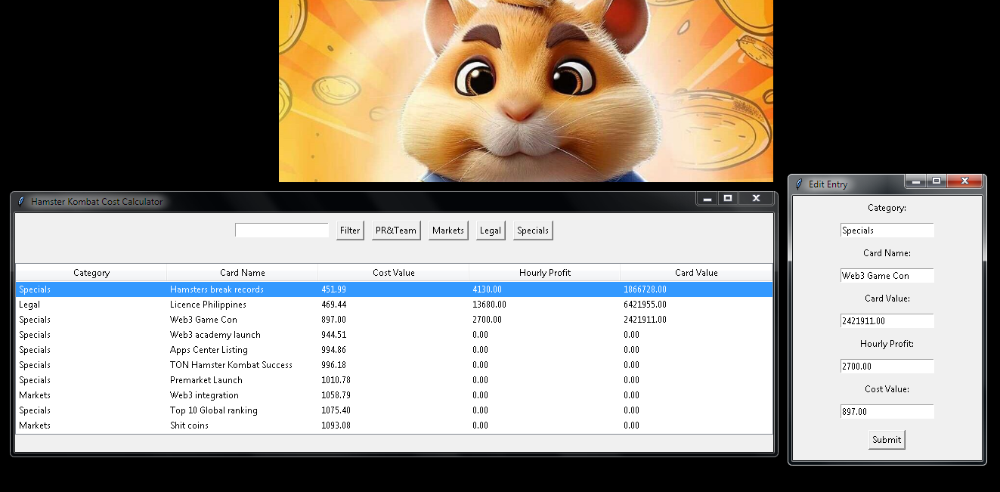

# Hamster Kombat Cost Calculator

Hamster Kombat Cost Calculator is a desktop application built using tkinter. This application allows you to enter and manage coin values and hourly profit data for cards across different categories. You can also filter data by card name or category and save your entries to a file.

## Features

- Ability to input card information by category.
- Capability to edit and delete data entries.
- Filtering by card name.
- Automatic saving of data to a file.

## Installation

1. Python should be installed (version 3.x).
2. Install the necessary libraries by running the following command in your terminal or command prompt:
3. Download or clone the `main.py` file.

## Usage

1. Navigate to the directory where `main.py` is located in your terminal or command prompt.
2. Start the application by running the following command:
3. Upon launching the application, you can enter, edit, and filter card information as needed.

## Screenshots

# Profitability Calculations

In this section, we will calculate the profitability ratio of two products. The hourly profit ratio is obtained by dividing the product price by the hourly profit.

**Profitability Ratio** = Product Price / Hourly Profit

## Product 1

- **Product Price:** 12,109,555 TL
- **Hourly Profit:** 14,640 TL/hour

**Profitability Ratio**: 12,109,555 / 14,640 ≈ 827.22 hours

## Product 2

- **Product Price:** 6,969,348 TL
- **Hourly Profit:** 5,060 TL/hour

**Profitability Ratio**: 6,969,348 / 5,060 ≈ 1377.25 hours

According to this calculation, **the first product is more profitable** because it has a lower profitability ratio.

## Contributing

1. Fork this project.
2. Add new features or fixes.
3. Submit a pull request.

## License

This project is licensed under the MIT License. For more information, see the `LICENSE` file.
